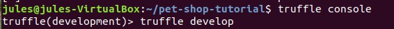
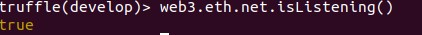
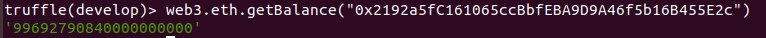
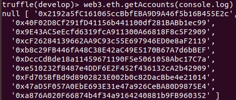
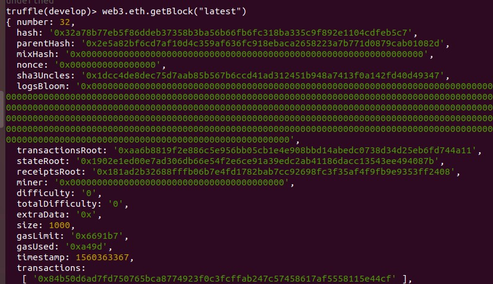
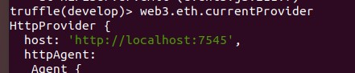
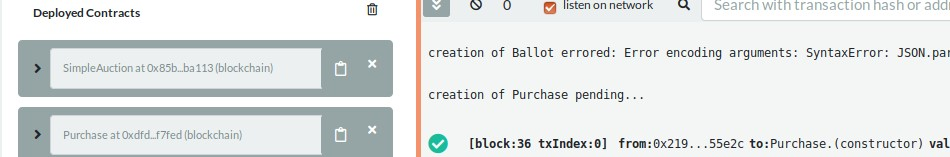

# GES 1 DISEÑO Y DESARROLLO I

### BLOQUE 1: FUNDAMENTOS Y HERRAMIENTAS

- Comprobar que existe conexión a un nodo.  
Dentro de la ruta donde esta desplegado truffle y web3 se ejecuta la consola  

Para saber si esta escuchando la blockchain de Ganache  

- Comprobar si está o no sincronizando nuevos bloques. ¿Por qué?

- Balance de la cuenta que ha desplegado el contrato en la blockchain.

- Address de la cuenta número 3 de Ganache o ganache-cli.

Para obtener todas las cuentas de Ganache  

- Número de bloque en el que se encuentra la blockchain en ese instante. ¿Por qué?

Ultimo Bloque (Latest), en mi caso el último es el 32  

- Dirección del host de la blockchain.  

- Acceda a ethgasstation y convierta el precio del gas en ese instante a Ether.

#### Solidity con Remix IDE

1. Ir a Remix IDE
2. Crear una nuevo contrato y Escribir el Codigo
3. Conectar con el servidor de Ganache http://localhost:7545
4. Seleccionar una de las cuentas con Ethers
5. Compilar el código del Smart Contract y Desplegarlo

